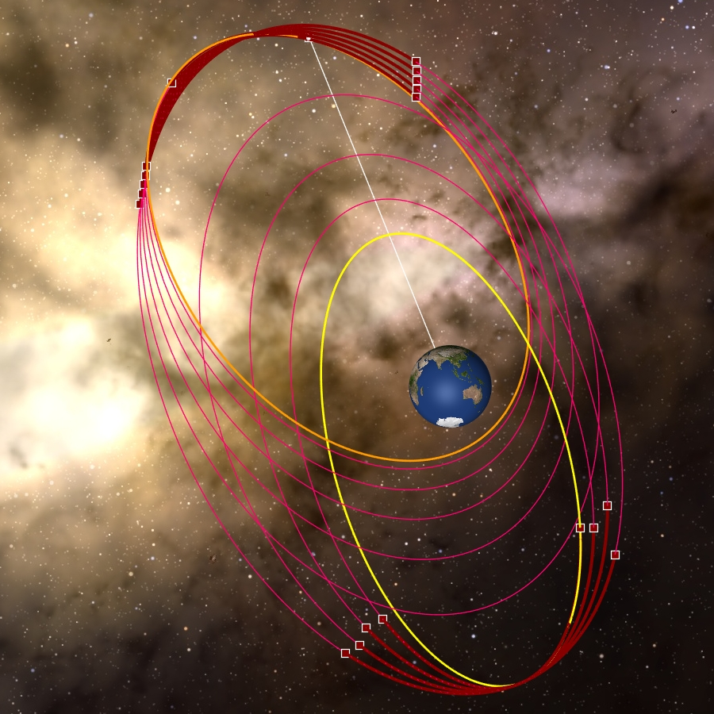
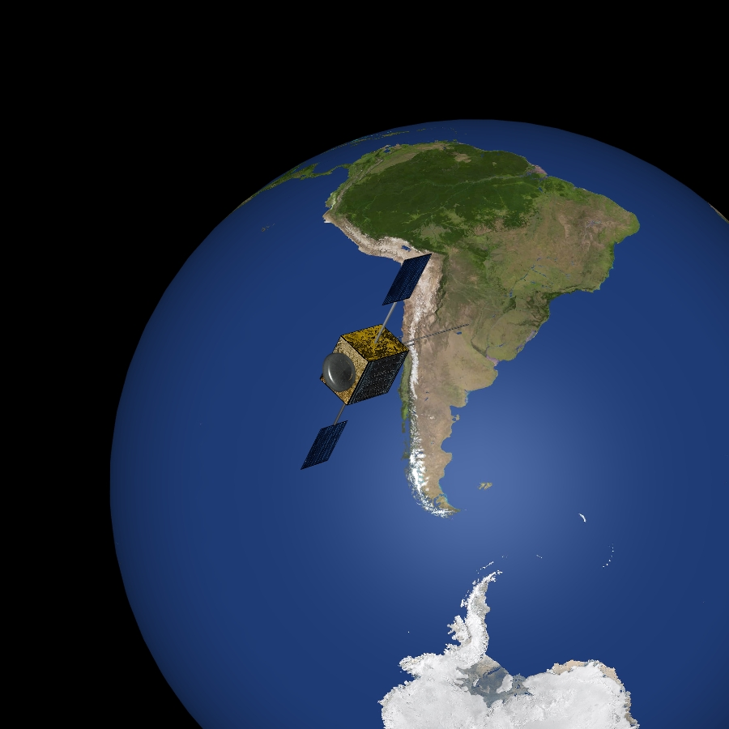

# Ultra-Precise Low-Thrust Transfer with Minimal Orbit Deviation

**Case ID:** `SIM-00001-00065`  
**Algorithm:** `AEDA`  
**Concept:** `Precision and Accuracy`  

This simulation showcases a highly accurate low-thrust orbit transfer where the final orbit is achieved with minimal deviation. A carefully tuned evolutionary algorithm ensures precise convergence to target orbital parameters. The spacecraft operates with on-off thrusting using real-world propulsion constraints. Watch how small corrections accumulate to deliver pinpoint orbital placement. Supplementary materials and tools can be found on the ZERUA platform and GitHub page.

✨ Key highlights:
- Final orbit achieved with near-zero deviation  
- High-resolution plots of orbital element evolution  
- Algorithm tuned for sub-kilometer precision  
- All data and tools linked via Zerua GitHub  

---

<table width="100%" border="0" cellspacing="0" cellpadding="0"><tr><td colspan="2" width="100%"></td></tr><tr><td width="50%"></td><td width="50%"></td></tr></table>

---

🎥 **Watch the simulation video on YouTube: [Ultra-Precise Low-Thrust Transfer with Minimal Orbit Deviation](https://www.youtube.com/watch?v=iEfZm7m4_fE)**  
📦 Supplementary materials and code are included in this folder.

---

## 🔗 Resources
- 🌐 Zerua Space: [zerua.space](https://www.zerua.space)  
- 🛰 Zerua Tech: [zerua.tech](https://www.zerua.tech)  
- 💻 GitHub Repository: [github.com/abolfazlshirazi/zerua](https://github.com/abolfazlshirazi/zerua)  
- 🎥 YouTube Channel: [@ZeruaTech](https://www.youtube.com/@ZeruaTech)  
- 🎞 YouTube Playlist: [Low-Thrust Space Trajectory Design and Optimization](https://www.youtube.com/playlist?list=PLJMfURpxHVVkWjTQBiavZLb4bVetN_96z)  

---

## 🏷 Tags
`Zerua` · `Zerua Tech` · `space trajectory optimization` · `low-thrust propulsion` · `precise orbit transfer` · `orbital mechanics` · `evolutionary algorithms` · `spacecraft simulation` · `AI in aerospace`

---

> #zerua #zeruatech #lowthrusttrajectoryoptimization #precisioninspace #orbitaccuracy

### 📱 Follow Us
- [LinkedIn](https://www.linkedin.com/company/zeruatech)  
- [Facebook](https://www.facebook.com/zeruatech/)  
- [Instagram](https://www.instagram.com/zeruatech)  
- [X (Twitter)](https://www.twitter.com/zeruatech)  
