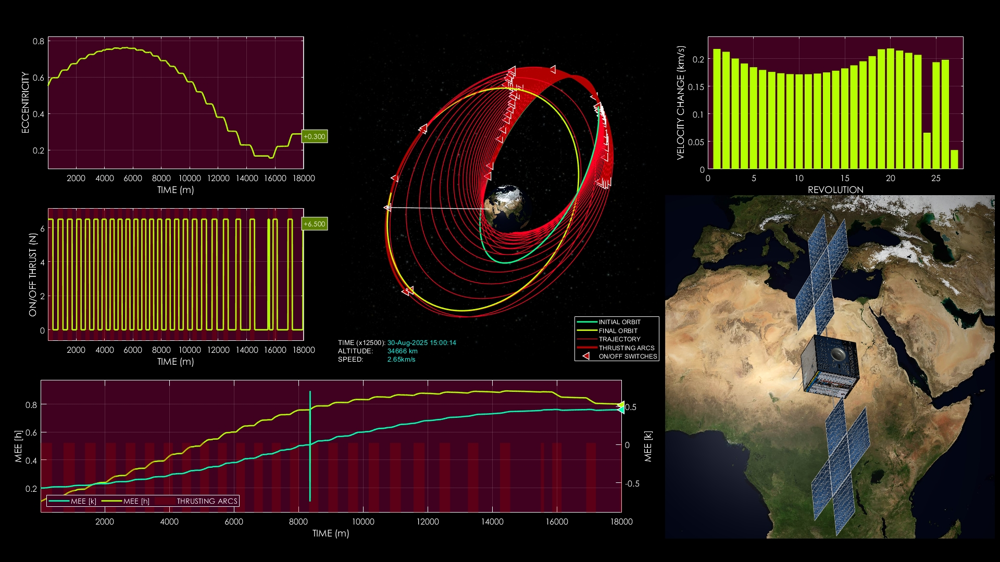
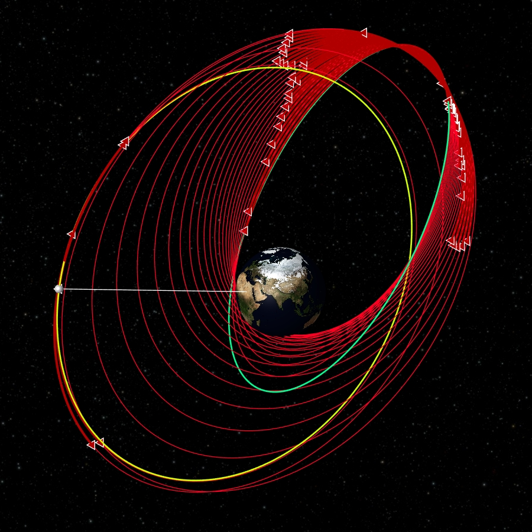
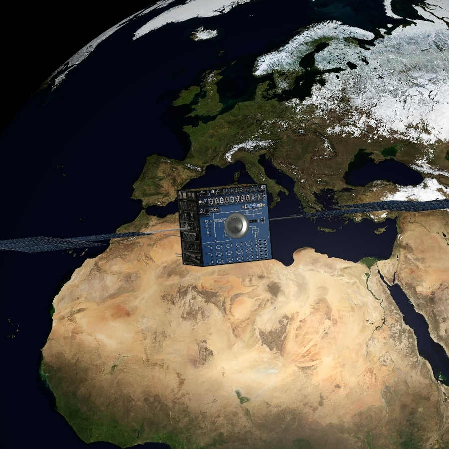

# Designing Low-Thrust Transfers for Earth Missions

**Case ID:** `SIM-00056-140499`  
**Algorithm:** `REDA`  
**Concept:** `Space Mission Design Relevance`  

This simulation demonstrates how low-thrust transfers can shape real mission scenarios in Earth orbit. The spacecraft gradually modifies its trajectory under on-off thrust, achieving a fuel-optimal path toward the final orbit. Key mission parameters and orbital element changes are visualized throughout the process. Supplementary materials and tools can be found on the ZERUA platform and GitHub page.

✨ Key highlights:
- Mission relevance of low-thrust transfers  
- Detailed orbital parameter evolution  
- Fuel-optimal trajectory planning  
- Practical Earth-orbit mission scenario  

---

<table width="100%" border="0" cellspacing="0" cellpadding="0"><tr><td colspan="2" width="100%"></td></tr><tr><td width="50%"></td><td width="50%"></td></tr></table>

---

🎥 **Watch the simulation video on YouTube: [Designing Low-Thrust Transfers for Earth Missions](https://www.youtube.com/watch?v=pXw8qPSJiAU)**  
📦 Supplementary materials and code are included in this folder.

---

## 🔗 Resources
- 🌐 Zerua Space: [zerua.space](https://www.zerua.space)  
- 🛰 Zerua Tech: [zerua.tech](https://www.zerua.tech)  
- 💻 GitHub Repository: [github.com/abolfazlshirazi/zerua](https://github.com/abolfazlshirazi/zerua)  
- 🎥 YouTube Channel: [@ZeruaTech](https://www.youtube.com/@ZeruaTech)  
- 🎞 YouTube Playlist: [Low-Thrust Space Trajectory Design and Optimization](https://www.youtube.com/playlist?list=PLJMfURpxHVVkWjTQBiavZLb4bVetN_96z)  

---

## 🏷 Tags
`Zerua` · ` Zerua Tech` · ` low thrust trajectory` · ` space mission design` · ` spacecraft transfer` · ` astrodynamics` · ` orbital mechanics` · ` Earth orbit transfer` · ` AI in space` · ` evolutionary algorithms`

---

> #zerua #zeruatech #lowthrusttrajectoryoptimization #spacemissiondesign #astrodynamics

### 📱 Follow Us
- [LinkedIn](https://www.linkedin.com/company/zeruatech)  
- [Facebook](https://www.facebook.com/zeruatech/)  
- [Instagram](https://www.instagram.com/zeruatech)  
- [X (Twitter)](https://www.twitter.com/zeruatech)  
