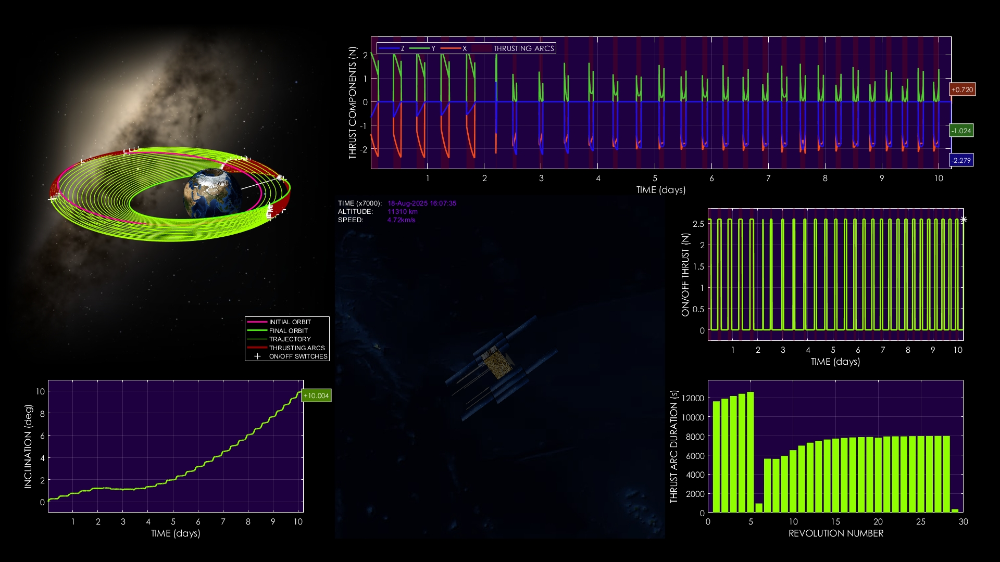
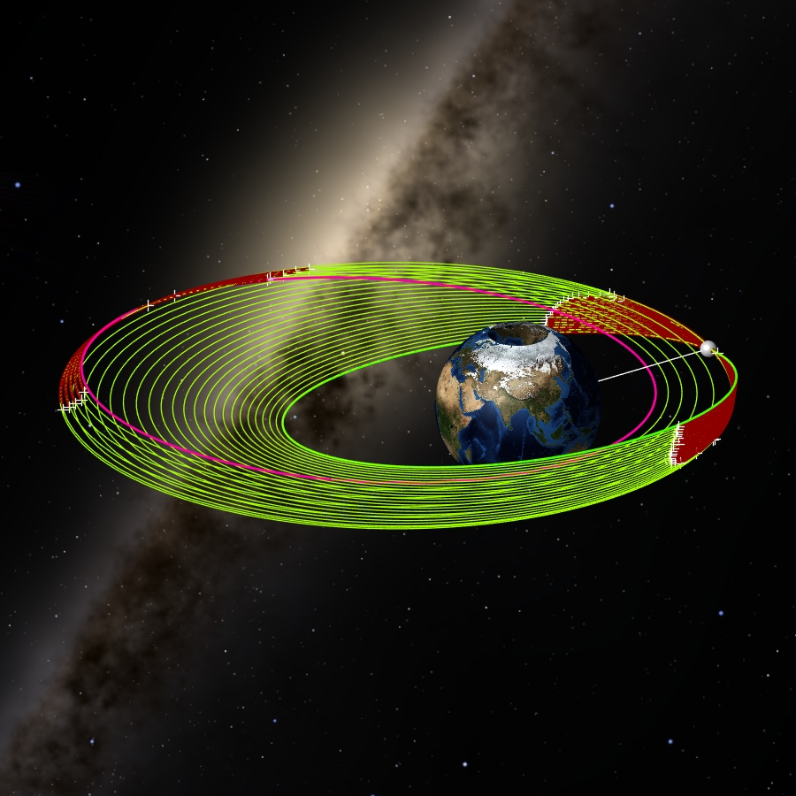
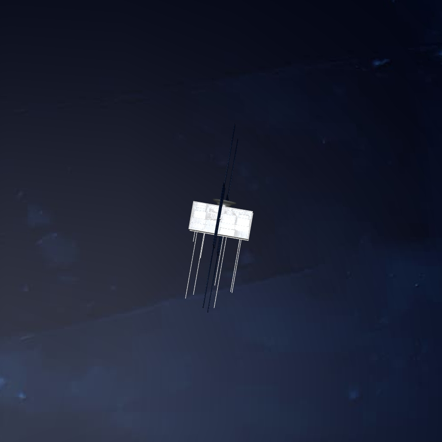

# High-Fidelity Low-Thrust Orbit Transfer with Detailed Simulation Plots

**Case ID:** `SIM-00088-01365`  
**Algorithm:** `MFLTOA`  
**Concept:** `Visualization and Simulation Quality`  

This video showcases a low-thrust orbit transfer with high-fidelity 3D visualization and comprehensive simulation plots. Key plots include inclination variation, thrust arc duration, on/off thrust events, and thrust components along the trajectory. The motion of the spacecraft around Earth is depicted with multiple viewpoints, including close-up satellite views and orbit perspectives. Supplementary materials and tools can be found on the ZERUA platform and GitHub page.

✨ Key highlights:
- High-fidelity 3D simulation of spacecraft orbit transfer  
- Plots include inclination, thrust arcs, on/off thrust, and thrust components  
- Multiple views: 3D, orbit perspective, satellite close-ups  
- 1080p 60fps video showcasing detailed spacecraft dynamics  

---

<table width="100%" border="0" cellspacing="0" cellpadding="0"><tr><td colspan="2" width="100%"></td></tr><tr><td width="50%"></td><td width="50%"></td></tr></table>

---

🎥 **Watch the simulation video on YouTube: [High-Fidelity Low-Thrust Orbit Transfer with Detailed Simulation Plots](https://www.youtube.com/watch?v=Qoxhvnu0xTY)**  
📦 Supplementary materials and code are included in this folder.

---

## 🔗 Resources
- 🌐 Zerua Space: [zerua.space](https://www.zerua.space)  
- 🛰 Zerua Tech: [zerua.tech](https://www.zerua.tech)  
- 💻 GitHub Repository: [github.com/abolfazlshirazi/zerua](https://github.com/abolfazlshirazi/zerua)  
- 🎥 YouTube Channel: [@ZeruaTech](https://www.youtube.com/@ZeruaTech)  
- 🎞 YouTube Playlist: [Low-Thrust Space Trajectory Design and Optimization](https://www.youtube.com/playlist?list=PLJMfURpxHVVkWjTQBiavZLb4bVetN_96z)  

---

## 🏷 Tags
`Zerua` · ` Zerua Tech` · ` orbit transfer` · ` low-thrust simulation` · ` trajectory visualization` · ` inclination plot` · ` thrust arc` · ` on-off thrust` · ` thrust components` · ` spacecraft dynamics` · ` astrodynamics` · ` orbital mechanics`

---

> #zerua #zeruatech #lowthrusttrajectoryoptimization #simulation #highfidelity #spacevisualization

### 📱 Follow Us
- [LinkedIn](https://www.linkedin.com/company/zeruatech)  
- [Facebook](https://www.facebook.com/zeruatech/)  
- [Instagram](https://www.instagram.com/zeruatech)  
- [X (Twitter)](https://www.twitter.com/zeruatech)  
