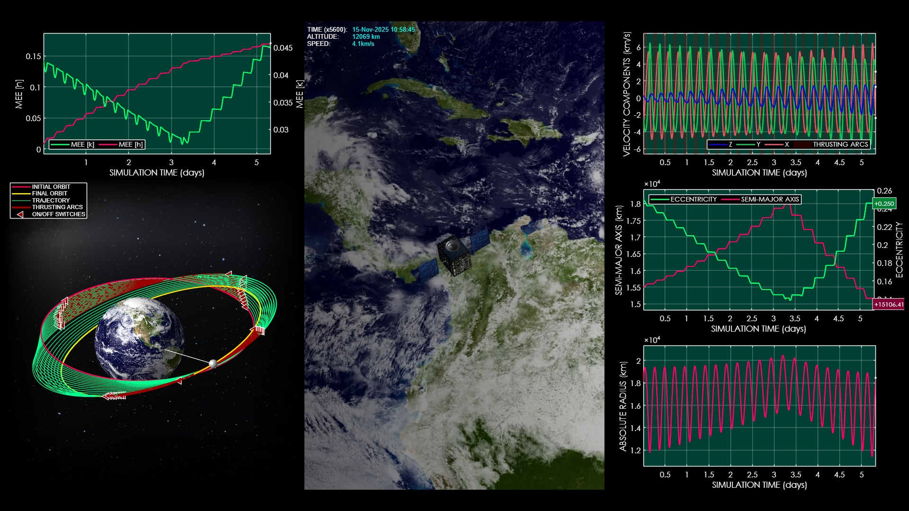
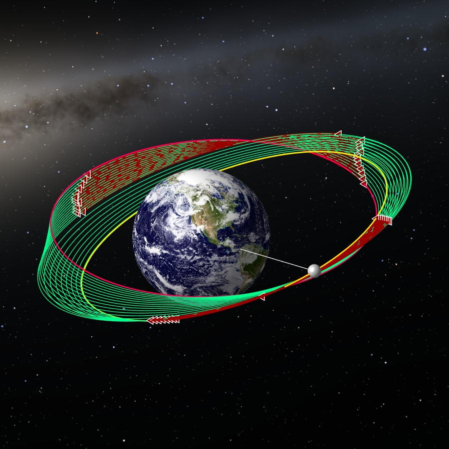

# AI-Driven Low-Thrust Transfer: Autonomous Orbit Shaping Around Earth

**Case ID:** `SIM-00105-29810`  
**Algorithm:** `REDA`  
**Concept:** `AI and Automation`  

This simulation presents a fuel-optimal low-thrust orbital transfer generated through an AI-driven evolutionary optimization process. The spacecraft gradually reshapes its orbit using an on-off thrust strategy while maintaining high accuracy at the final target orbit. Multiple views and performance plots illustrate the dynamics, thrusting phases, and mass evolution throughout the transfer. Supplementary materials and tools can be found on the ZERUA platform and the Zerua GitHub page.

✨ Key highlights:
- AI-Driven Evolutionary Optimization  
- Autonomous On-Off Thrust Strategy  
- High-Accuracy Final Orbit Matching  
- Full 3D Visualization with Performance Plots  

---

<table width="100%" border="0" cellspacing="0" cellpadding="0"><tr><td colspan="2" width="100%"></td></tr><tr><td width="50%"></td><td width="50%"></td></tr></table>

---

🎥 **Watch the simulation video on YouTube: [AI-Driven Low-Thrust Transfer: Autonomous Orbit Shaping Around Earth](https://www.youtube.com/watch?v=tKMzck8AVV4)**  
📦 Supplementary materials and code are included in this folder.

---

## 🔗 Resources
- 🌐 Zerua Space: [zerua.space](https://www.zerua.space)  
- 🛰 Zerua Tech: [zerua.tech](https://www.zerua.tech)  
- 💻 GitHub Repository: [github.com/abolfazlshirazi/zerua](https://github.com/abolfazlshirazi/zerua)  
- 🎥 YouTube Channel: [@ZeruaTech](https://www.youtube.com/@ZeruaTech)  
- 🎞 YouTube Playlist: [Low-Thrust Space Trajectory Design and Optimization](https://www.youtube.com/playlist?list=PLJMfURpxHVVkWjTQBiavZLb4bVetN_96z)  

---

## 🏷 Tags
`Zerua` · ` Zerua Tech` · ` low thrust` · ` low-thrust trajectory` · ` AI optimization` · ` orbital mechanics` · ` spacecraft trajectory` · ` evolutionary algorithms` · ` satellite transfer` · ` space simulation` · ` aerospace engineering` · ` optimization` · ` trajectory design` · ` space technology`

---

> #zerua #zeruatech #lowthrusttrajectoryoptimization #AIoptimization #spacetrajectory #orbitalmechanics #spacetechnology #satellite #aerospaceengineering

### 📱 Follow Us
- [LinkedIn](https://www.linkedin.com/company/zeruatech)  
- [Facebook](https://www.facebook.com/zeruatech/)  
- [Instagram](https://www.instagram.com/zeruatech)  
- [X (Twitter)](https://www.twitter.com/zeruatech)  
