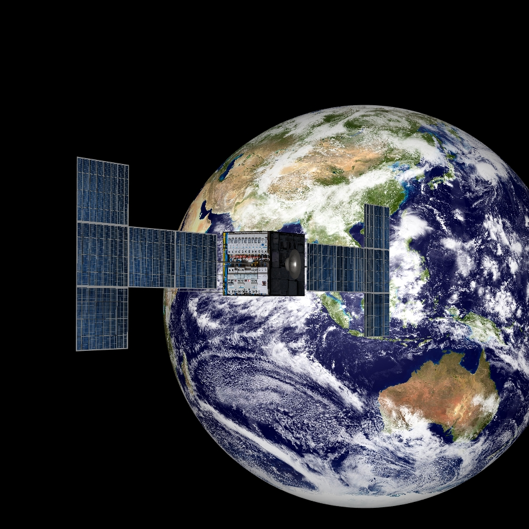

# Minimum-Fuel Low-Trust Space Trajectory Optimization

**Case ID:** `SIM-00166-00032`  
**Algorithm:** `MFLTOA`  
**Concept:** `Fuel Efficiency and Mass Savings`  

This simulation showcases an advanced low-thrust trajectory optimized for exceptional fuel efficiency during an Earth orbit transfer. The maneuver ensures minimal propellant consumption while precisely achieving the target orbit through intelligent on-off thrust control. The spacecraft’s mass variation and propellant usage are highlighted throughout the simulation, demonstrating the capabilities of cutting-edge AI-driven optimization. Supplementary materials and tools related to this simulation are available on the ZERUA platform and GitHub page.

✨ Key highlights:
- High Accuracy Orbit Insertion  
- Low-Thrust Optimization in Action  
- State Vector Plot Visuals  
- Evolutionary Algorithm Performance  

---

<table width="100%">
<tr>
  <td></td>
  <td></td>
  <td></td>
</tr>
</table>

---

🎥 **Watch the simulation video on YouTube: [Minimum-Fuel Low-Trust Space Trajectory Optimization](https://www.youtube.com/watch?v)**  
📦 Supplementary materials and code are included in this folder.

---

## 🔗 Resources
- 🌐 Zerua Space: [zerua.space](https://www.zerua.space)  
- 🛰 Zerua Tech: [zerua.tech](https://www.zerua.tech)  
- 💻 GitHub Repository: [github.com/abolfazlshirazi/zerua](https://github.com/abolfazlshirazi/zerua)  
- 🎥 YouTube Channel: [@ZeruaTech](https://www.youtube.com/@ZeruaTech)  
- 🎞 YouTube Playlist: [Low-Thrust Space Trajectory Design and Optimization](https://www.youtube.com/playlist?list=PLJMfURpxHVVkWjTQBiavZLb4bVetN_96z)  

---

## 🏷 Tags
`Zerua` · `Zerua Tech` · `low thrust` · `orbit transfer` · `fuel efficiency` · `trajectory optimization` · `spacecraft simulation` · `propellant saving` · `AI optimization` · `space engineering`

---

> #zerua #zeruatech #lowthrusttrajectoryoptimization #fuelefficiency #spacepropulsion #trajectoryoptimization #aiinscience

### 📱 Follow Us
- [LinkedIn](https://www.linkedin.com/company/zeruatech)  
- [Facebook](https://www.facebook.com/zeruatech/)  
- [Instagram](https://www.instagram.com/zeruatech)  
- [X (Twitter)](https://www.twitter.com/zeruatech)  
