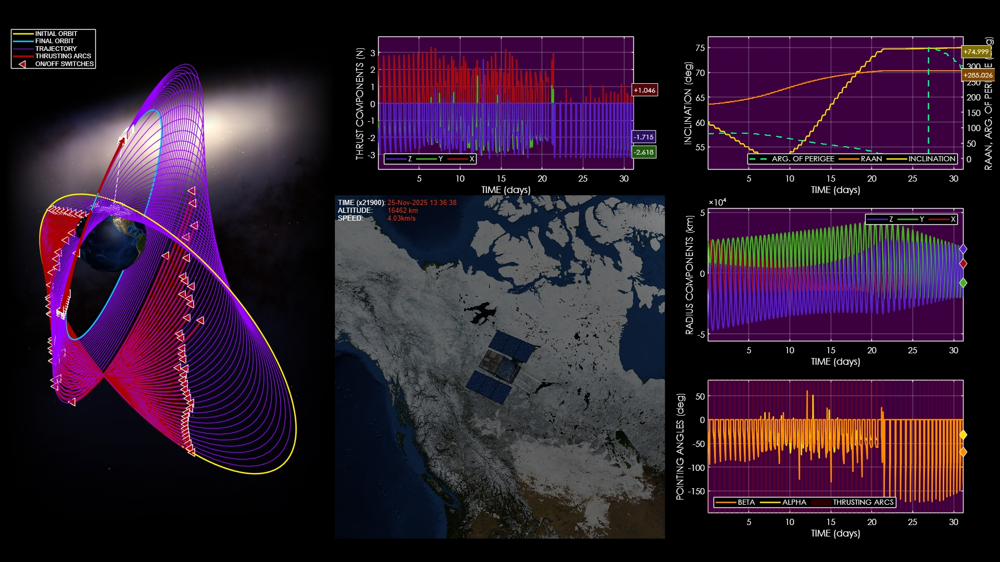
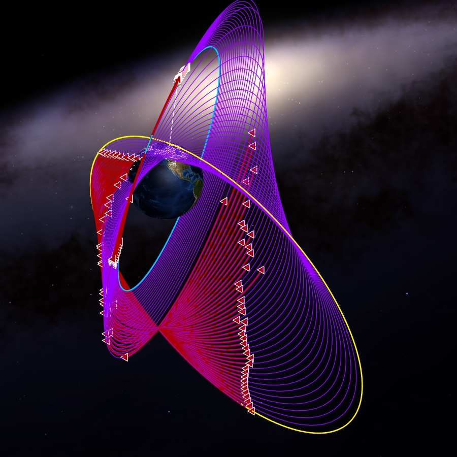

# High-Fidelity 3D Simulation of Low-Thrust Orbit Evolution

**Case ID:** `SIM-00275-22701`  
**Algorithm:** `MFLTOA`  
**Concept:** `Visualization and Simulation Quality`  

This visualization presents a detailed 3D simulation of a low-thrust orbital transfer around Earth. The high-fidelity rendering displays spacecraft motion, thrust activation phases, and gradual orbital transitions with precision. Multiple synchronized plots reveal position, velocity, and orbital element evolution throughout the maneuver. Supplementary materials and tools can be found on the ZERUA platform and GitHub page.

✨ Key highlights:
- High-fidelity 3D visualization  
- Detailed orbit evolution  
- Dynamic on-off thrust representation  
- Multiple synchronized plots displayed  

---

<table width="100%" border="0" cellspacing="0" cellpadding="0"><tr><td colspan="2" width="100%"></td></tr><tr><td width="50%"></td><td width="50%"></td></tr></table>

---

🎥 **Watch the simulation video on YouTube: [High-Fidelity 3D Simulation of Low-Thrust Orbit Evolution](https://www.youtube.com/watch?v=q9FRGpF9GIA)**  
📦 Supplementary materials and code are included in this folder.

---

## 🔗 Resources
- 🌐 Zerua Space: [zerua.space](https://www.zerua.space)  
- 🛰 Zerua Tech: [zerua.tech](https://www.zerua.tech)  
- 💻 GitHub Repository: [github.com/abolfazlshirazi/zerua](https://github.com/abolfazlshirazi/zerua)  
- 🎥 YouTube Channel: [@ZeruaTech](https://www.youtube.com/@ZeruaTech)  
- 🎞 YouTube Playlist: [Low-Thrust Space Trajectory Design and Optimization](https://www.youtube.com/playlist?list=PLJMfURpxHVVkWjTQBiavZLb4bVetN_96z)  

---

## 🏷 Tags
`Zerua` · `Zerua Tech` · `low thrust` · `orbit simulation` · `space trajectory visualization` · `3D animation` · `spacecraft dynamics` · `orbital elements` · `trajectory optimization` · `space engineering`

---

> #zerua #zeruatech #lowthrusttrajectoryoptimization #3Dsimulation #orbitalvisualization

### 📱 Follow Us
- [LinkedIn](https://www.linkedin.com/company/zeruatech)  
- [Facebook](https://www.facebook.com/zeruatech/)  
- [Instagram](https://www.instagram.com/zeruatech)  
- [X (Twitter)](https://www.twitter.com/zeruatech)  
