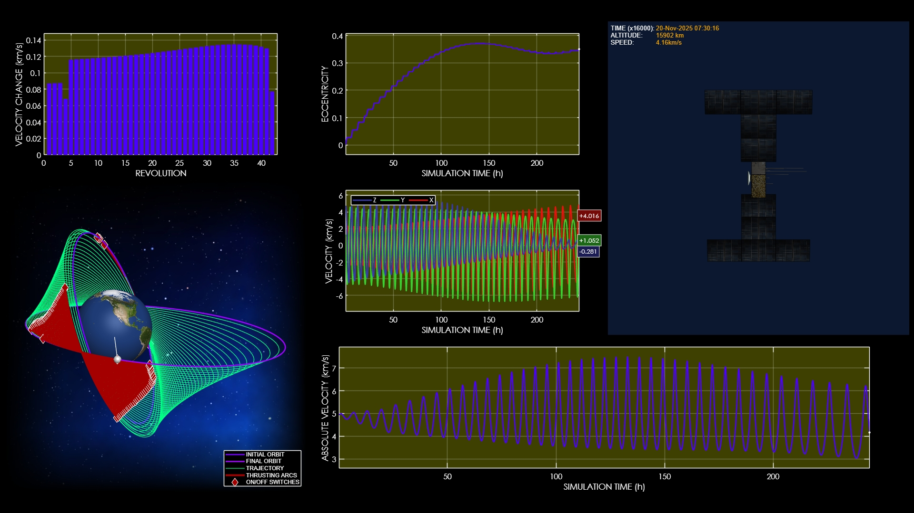
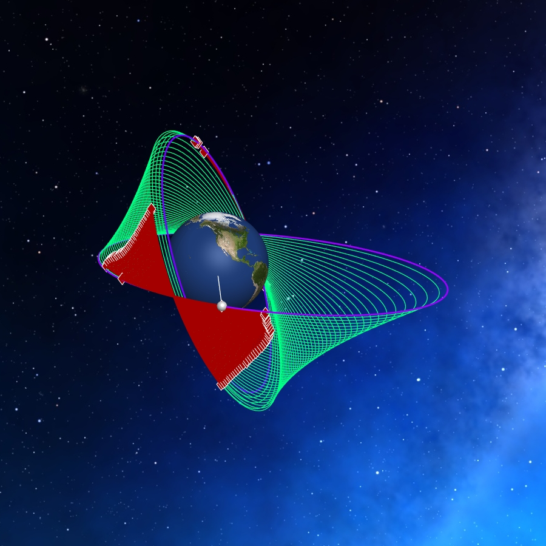
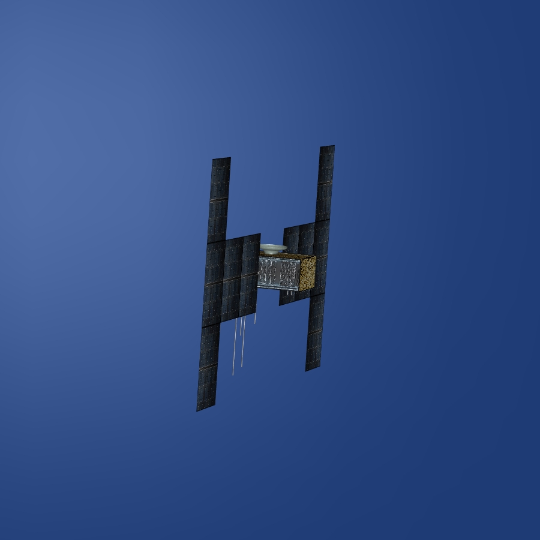

# Precision-Oriented Low-Thrust Orbit Transfer Simulation

**Case ID:** `SIM-00375-19711`  
**Algorithm:** `REDA`  
**Concept:** `Precision and Accuracy`  

This simulation highlights the precision of a low-thrust orbital transfer solution optimized for accurate final orbit matching. The spacecraft follows an on-off thrust sequence designed to minimize deviations in orbital parameters. The final trajectory demonstrates high positional accuracy achieved through evolutionary optimization. Supplementary materials and tools can be found on the ZERUA platform and GitHub page.

✨ Key highlights:
- High-precision orbit achievement  
- Accurate on-off thrust execution  
- Evolutionary optimization for precision  
- Deviation minimization in final orbit  

---

<table width="100%" border="0" cellspacing="0" cellpadding="0"><tr><td colspan="2" width="100%"></td></tr><tr><td width="50%"></td><td width="50%"></td></tr></table>

---

🎥 **Watch the simulation video on YouTube: [Precision-Oriented Low-Thrust Orbit Transfer Simulation](https://www.youtube.com/watch?v=aIc5VdTxU8Q)**  
📦 Supplementary materials and code are included in this folder.

---

## 🔗 Resources
- 🌐 Zerua Space: [zerua.space](https://www.zerua.space)  
- 🛰 Zerua Tech: [zerua.tech](https://www.zerua.tech)  
- 💻 GitHub Repository: [github.com/abolfazlshirazi/zerua](https://github.com/abolfazlshirazi/zerua)  
- 🎥 YouTube Channel: [@ZeruaTech](https://www.youtube.com/@ZeruaTech)  
- 🎞 YouTube Playlist: [Low-Thrust Space Trajectory Design and Optimization](https://www.youtube.com/playlist?list=PLJMfURpxHVVkWjTQBiavZLb4bVetN_96z)  

---

## 🏷 Tags
`Zerua` · `Zerua Tech` · `orbit transfer` · `low thrust optimization` · `precision trajectory` · `accurate orbit design` · `evolutionary algorithms` · `AI optimization` · `orbital mechanics` · `space simulation` · `trajectory accuracy`

---

> #zerua #zeruatech #lowthrusttrajectoryoptimization #precision #accuratetrajectory

### 📱 Follow Us
- [LinkedIn](https://www.linkedin.com/company/zeruatech)  
- [Facebook](https://www.facebook.com/zeruatech/)  
- [Instagram](https://www.instagram.com/zeruatech)  
- [X (Twitter)](https://www.twitter.com/zeruatech)  
