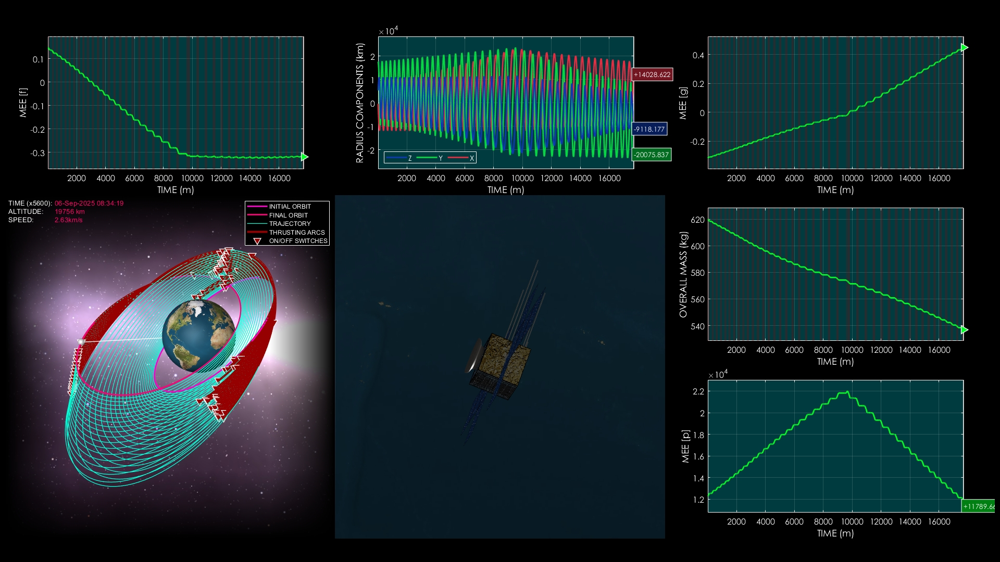
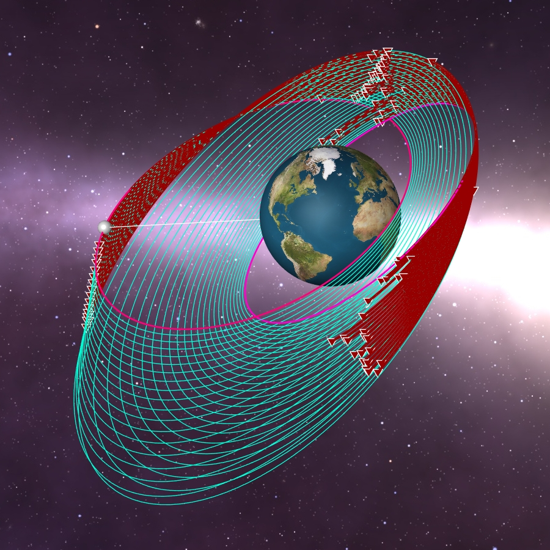
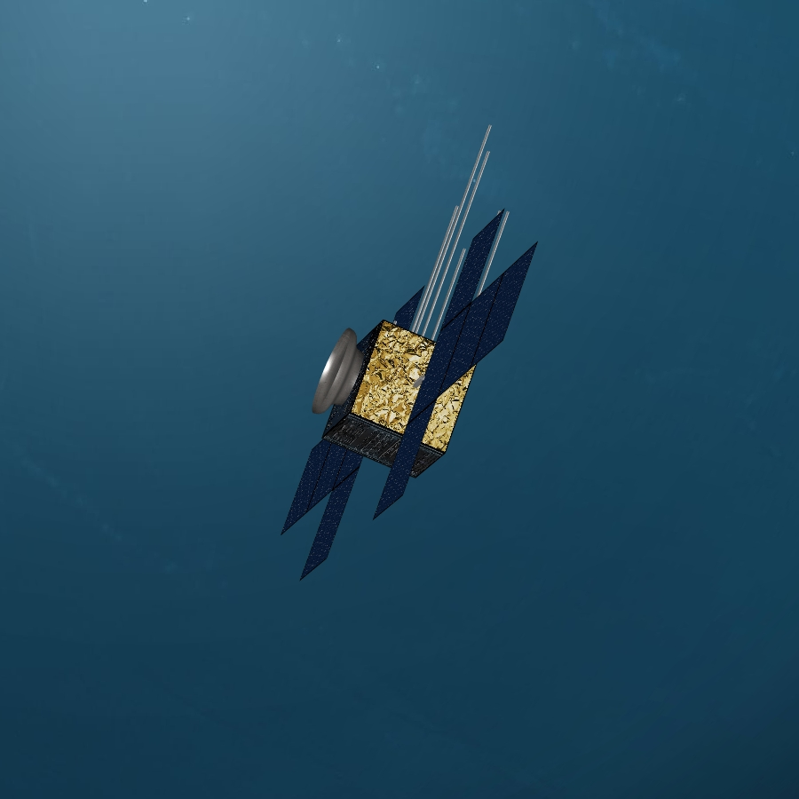

# Modified Equinoctial Elements in an Immersive 3D Visualization of Low-Thrust Orbital Maneuver

**Case ID:** `SIM-00441-00273`  
**Algorithm:** `REDA`  
**Concept:** `Visualization and Simulation Quality`  

Experience a detailed low-thrust orbital transfer simulation with high-quality 3D visuals and smooth motion. Multiple camera views showcase the spacecraft, trajectory, and orbital evolution in real time. Comprehensive plots present position, velocity, and modified equinoctial orbital elements with clarity. Supplementary materials and tools can be found on the ZERUA platform and GitHub page.

✨ Key highlights:
- High-quality 3D visuals and smooth rendering  
- Multiple dynamic camera perspectives  
- Clear and informative orbital plots  
- Data and tools available on ZERUA platform and GitHub  

---

<table width="100%" border="0" cellspacing="0" cellpadding="0"><tr><td colspan="2" width="100%"></td></tr><tr><td width="50%"></td><td width="50%"></td></tr></table>

---

🎥 **Watch the simulation video on YouTube: [Modified Equinoctial Elements in an Immersive 3D Visualization of Low-Thrust Orbital Maneuver](https://www.youtube.com/watch?v=YjJXmitQ8MQ=)**  
📦 Supplementary materials and code are included in this folder.

---

## 🔗 Resources
- 🌐 Zerua Space: [zerua.space](https://www.zerua.space)  
- 🛰 Zerua Tech: [zerua.tech](https://www.zerua.tech)  
- 💻 GitHub Repository: [github.com/abolfazlshirazi/zerua](https://github.com/abolfazlshirazi/zerua)  
- 🎥 YouTube Channel: [@ZeruaTech](https://www.youtube.com/@ZeruaTech)  
- 🎞 YouTube Playlist: [Low-Thrust Space Trajectory Design and Optimization](https://www.youtube.com/playlist?list=PLJMfURpxHVVkWjTQBiavZLb4bVetN_96z)  

---

## 🏷 Tags
`Zerua` · `Zerua Tech` · `space visualization` · `3D space simulation` · `low-thrust maneuver` · `orbital transfer` · `spacecraft trajectory` · `space engineering` · `orbital mechanics` · `simulation quality` · `modified equinoctial elements`

---

> #zerua #zeruatech #lowthrusttrajectoryoptimization #spacevisualization #modifiedequinoctialelements

### 📱 Follow Us
- [LinkedIn](https://www.linkedin.com/company/zeruatech)  
- [Facebook](https://www.facebook.com/zeruatech/)  
- [Instagram](https://www.instagram.com/zeruatech)  
- [X (Twitter)](https://www.twitter.com/zeruatech)  
