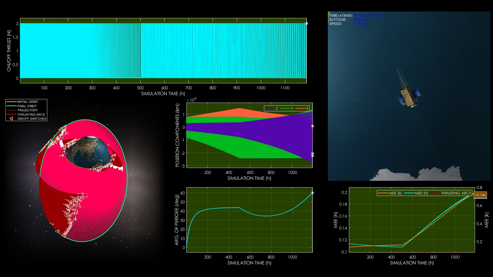
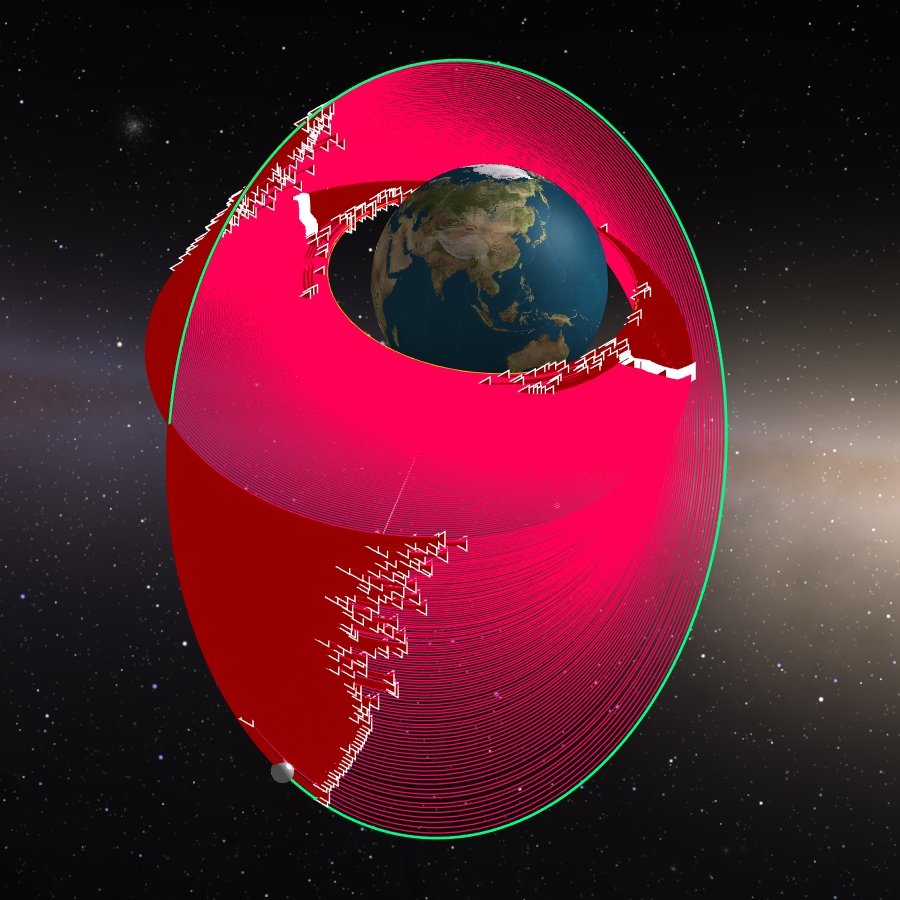
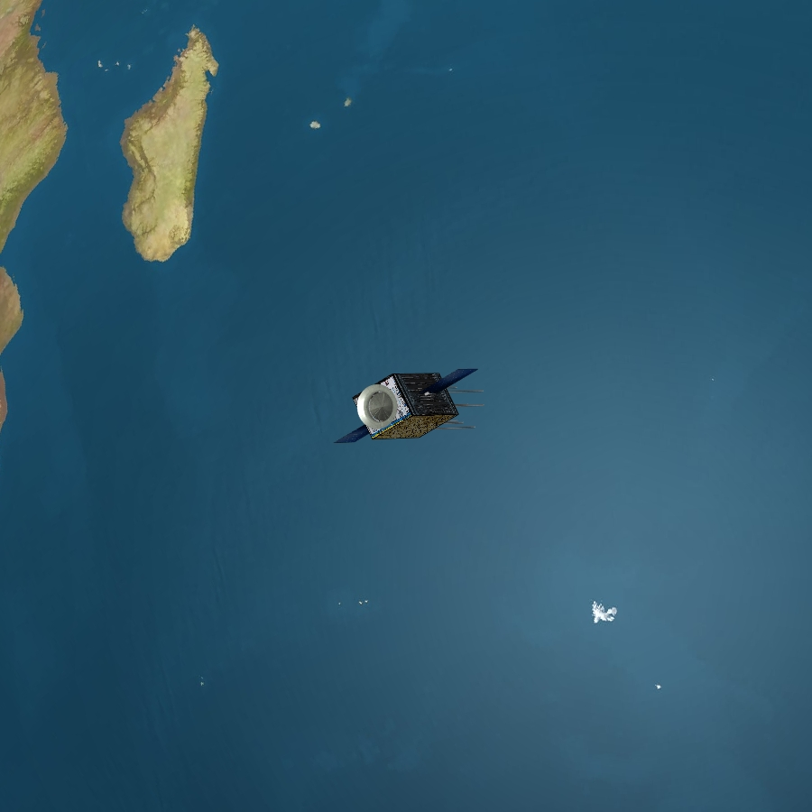

# Maximizing Fuel Efficiency in Low-Thrust Earth Orbit Transfers

**Case ID:** `SIM-00626-11021`  
**Algorithm:** `REDA`  
**Concept:** `Fuel Efficiency and Mass Savings`  

This simulation demonstrates a low-thrust orbital transfer optimized for fuel efficiency, highlighting significant propellant savings over impulsive methods. The spacecraft follows an on-off thrust profile while gradually adjusting its orbit around Earth. Results show the mass savings achieved with AI-driven evolutionary optimization. Supplementary materials and tools can be found on the ZERUA platform and GitHub page.

✨ Key highlights:
- Fuel-efficient orbital transfer  
- AI-driven evolutionary optimization  
- On-off thrust profile visualization  
- Propellant savings demonstrated  

---

<table width="100%" border="0" cellspacing="0" cellpadding="0"><tr><td colspan="2" width="100%"></td></tr><tr><td width="50%"></td><td width="50%"></td></tr></table>

---

🎥 **Watch the simulation video on YouTube: [Maximizing Fuel Efficiency in Low-Thrust Earth Orbit Transfers](https://www.youtube.com/watch?v=ttcwgglVGXM)**  
📦 Supplementary materials and code are included in this folder.

---

## 🔗 Resources
- 🌐 Zerua Space: [zerua.space](https://www.zerua.space)  
- 🛰 Zerua Tech: [zerua.tech](https://www.zerua.tech)  
- 💻 GitHub Repository: [github.com/abolfazlshirazi/zerua](https://github.com/abolfazlshirazi/zerua)  
- 🎥 YouTube Channel: [@ZeruaTech](https://www.youtube.com/@ZeruaTech)  
- 🎞 YouTube Playlist: [Low-Thrust Space Trajectory Design and Optimization](https://www.youtube.com/playlist?list=PLJMfURpxHVVkWjTQBiavZLb4bVetN_96z)  

---

## 🏷 Tags
`Zerua` · `Zerua Tech` · `low thrust` · `fuel optimal trajectory` · `orbit transfer` · `space trajectory design` · `evolutionary algorithms` · `propellant savings` · `AI optimization` · `orbital mechanics` · `trajectory planning`

---

> #zerua #zeruatech #lowthrusttrajectoryoptimization #fuelefficiency #spaceoptimization

### 📱 Follow Us
- [LinkedIn](https://www.linkedin.com/company/zeruatech)  
- [Facebook](https://www.facebook.com/zeruatech/)  
- [Instagram](https://www.instagram.com/zeruatech)  
- [X (Twitter)](https://www.twitter.com/zeruatech)  
