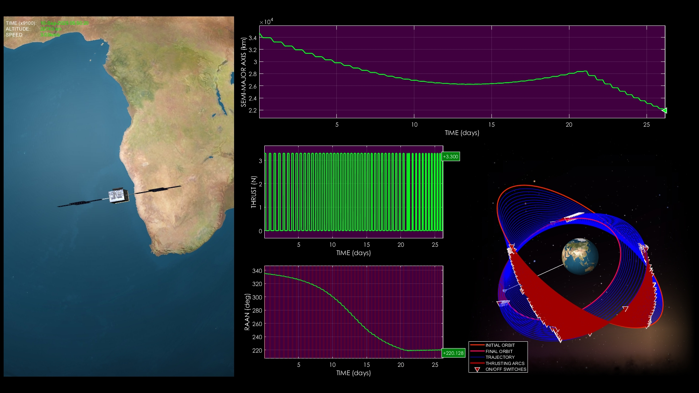
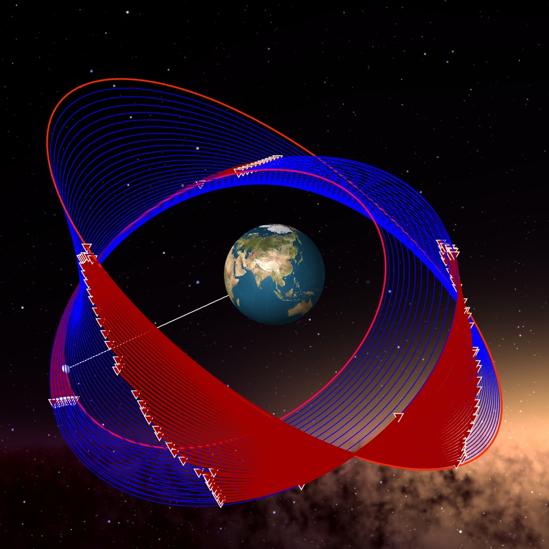

# Ultra-Precise Low-Thrust Orbit Transfer Simulation

**Case ID:** `SIM-00745-06050`  
**Algorithm:** `REDA`  
**Concept:** `Precision and Accuracy`  

This simulation demonstrates a low-thrust trajectory where precision plays the key role. The spacecraft gradually modifies its orbit with on-off thrusting until the final orbital parameters are matched with minimal error. High accuracy in reaching the target orbit ensures robust mission reliability. Supplementary materials and tools can be found on the ZERUA platform and GitHub page.

✨ Key highlights:
- Final orbit achieved with high accuracy  
- Detailed plots of orbital element convergence  
- Fuel-optimal thrusting profile  
- 1080p 60fps simulation with multiple visual perspectives  

---

<table width="100%" border="0" cellspacing="0" cellpadding="0"><tr><td colspan="2" width="100%"></td></tr><tr><td width="50%"></td><td width="50%"></td></tr></table>

---

🎥 **Watch the simulation video on YouTube: [Ultra-Precise Low-Thrust Orbit Transfer Simulation](https://www.youtube.com/watch?v=4uQUsvNshZ8)**  
📦 Supplementary materials and code are included in this folder.

---

## 🔗 Resources
- 🌐 Zerua Space: [zerua.space](https://www.zerua.space)  
- 🛰 Zerua Tech: [zerua.tech](https://www.zerua.tech)  
- 💻 GitHub Repository: [github.com/abolfazlshirazi/zerua](https://github.com/abolfazlshirazi/zerua)  
- 🎥 YouTube Channel: [@ZeruaTech](https://www.youtube.com/@ZeruaTech)  
- 🎞 YouTube Playlist: [Low-Thrust Space Trajectory Design and Optimization](https://www.youtube.com/playlist?list=PLJMfURpxHVVkWjTQBiavZLb4bVetN_96z)  

---

## 🏷 Tags
`Zerua` · `Zerua Tech` · `low thrust transfer` · `precision orbit transfer` · `space trajectory` · `orbit simulation` · `AI optimization` · `orbital mechanics`

---

> #zerua #zeruatech #lowthrusttrajectoryoptimization #orbitalprecision #spaceengineering

### 📱 Follow Us
- [LinkedIn](https://www.linkedin.com/company/zeruatech)  
- [Facebook](https://www.facebook.com/zeruatech/)  
- [Instagram](https://www.instagram.com/zeruatech)  
- [X (Twitter)](https://www.twitter.com/zeruatech)  
