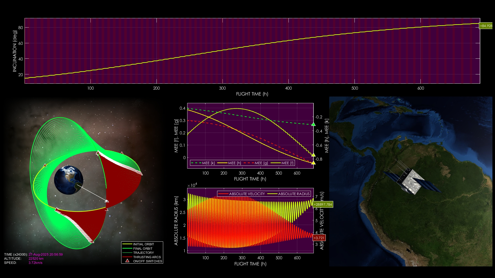
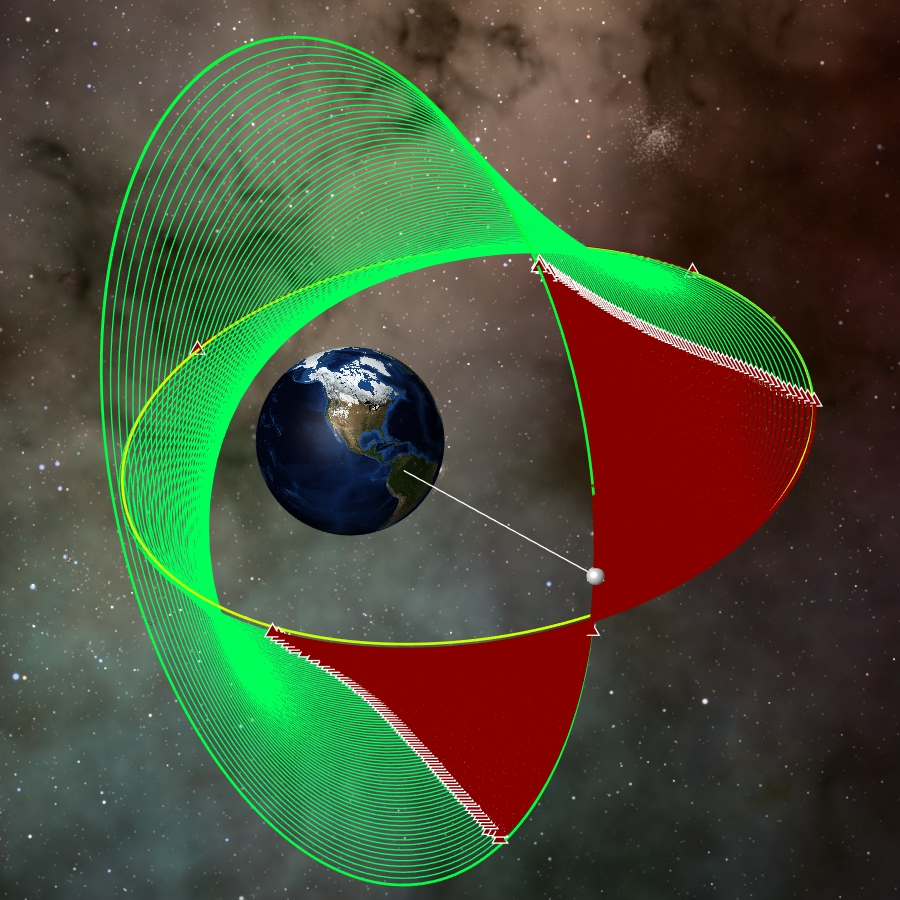
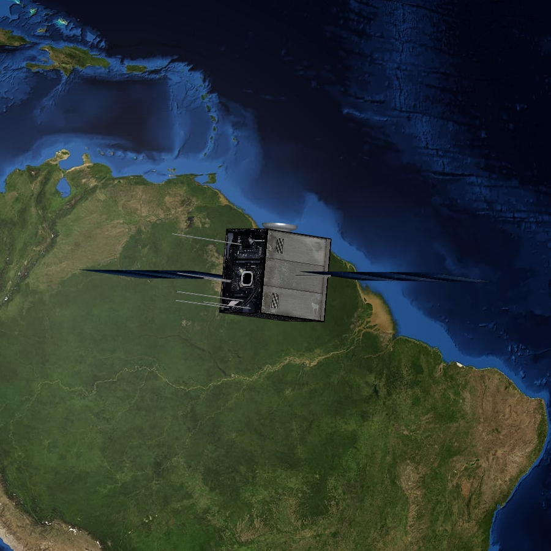

# Accurate Low-Thrust Transfer with Element Tracking

**Case ID:** `SIM-00776-66782`  
**Algorithm:** `REDA`  
**Concept:** `Precision and Accuracy`  

This video showcases a fuel-optimal low-thrust orbital transfer with a strong focus on precision in trajectory shaping. Plots highlight modified equinoctial element evolution, inclination adjustments, and variations in absolute velocity and radius throughout the maneuver. The final orbit is achieved with high accuracy in both position and orbital parameters. Supplementary materials and tools can be found on the ZERUA platform and GitHub page.

✨ Key highlights:
- Modified equinoctial element evolution  
- Inclination adjustment with accuracy tracking  
- Absolute velocity and radius variations plotted  
- Precise achievement of the target orbit  

---

<table width="100%" border="0" cellspacing="0" cellpadding="0"><tr><td colspan="2" width="100%"></td></tr><tr><td width="50%"></td><td width="50%"></td></tr></table>

---

🎥 **Watch the simulation video on YouTube: [Accurate Low-Thrust Transfer with Element Tracking](https://www.youtube.com/watch?v=N5Tv37SLCT4)**  
📦 Supplementary materials and code are included in this folder.

---

## 🔗 Resources
- 🌐 Zerua Space: [zerua.space](https://www.zerua.space)  
- 🛰 Zerua Tech: [zerua.tech](https://www.zerua.tech)  
- 💻 GitHub Repository: [github.com/abolfazlshirazi/zerua](https://github.com/abolfazlshirazi/zerua)  
- 🎥 YouTube Channel: [@ZeruaTech](https://www.youtube.com/@ZeruaTech)  
- 🎞 YouTube Playlist: [Low-Thrust Space Trajectory Design and Optimization](https://www.youtube.com/playlist?list=PLJMfURpxHVVkWjTQBiavZLb4bVetN_96z)  

---

## 🏷 Tags
`Zerua` · `Zerua Tech` · `precise orbit transfer` · `low thrust trajectory` · `orbital accuracy` · `equinoctial elements` · `inclination change` · `absolute velocity` · `orbital radius` · `AI trajectory optimization` · `orbital mechanics` · `spacecraft simulation`

---

> #zerua #zeruatech #lowthrusttrajectoryoptimization #precision #orbitaldynamics

### 📱 Follow Us
- [LinkedIn](https://www.linkedin.com/company/zeruatech)  
- [Facebook](https://www.facebook.com/zeruatech/)  
- [Instagram](https://www.instagram.com/zeruatech)  
- [X (Twitter)](https://www.twitter.com/zeruatech)  
