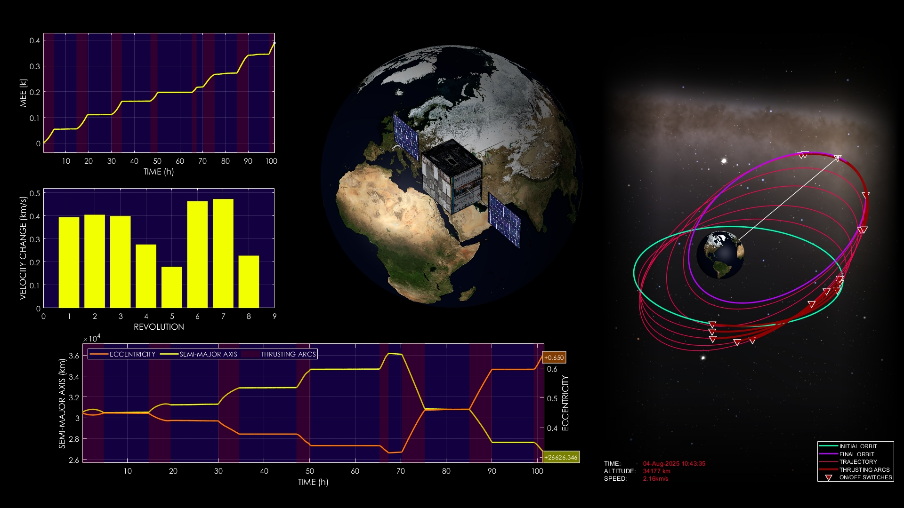
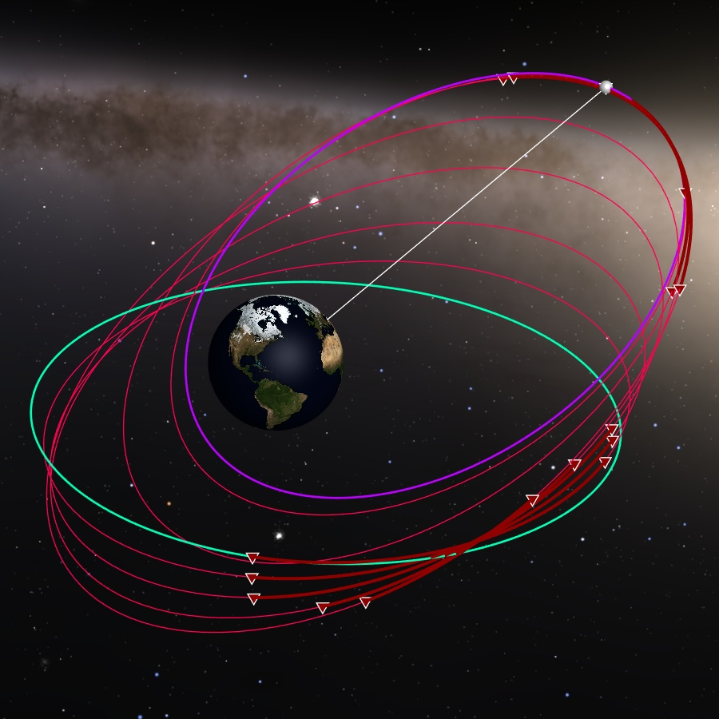
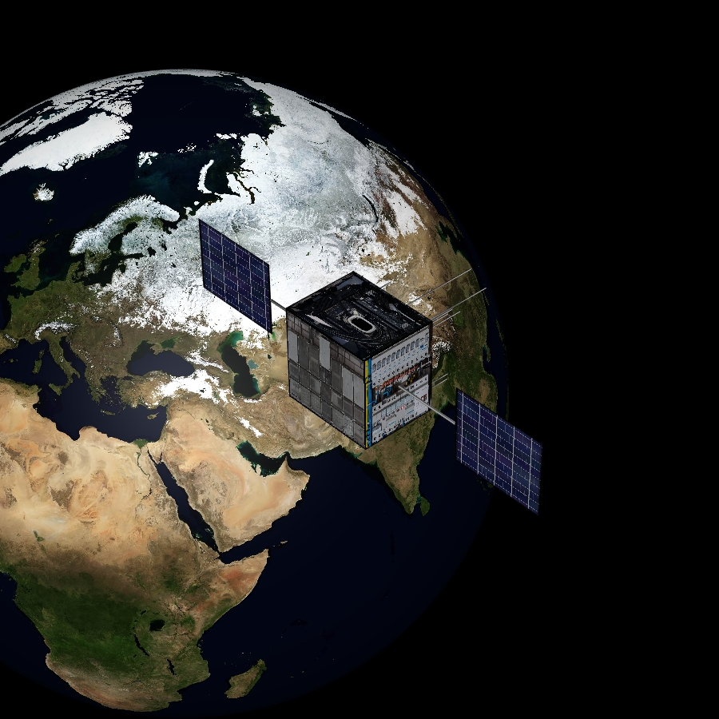

# Hybrid Evolutionary Algorithm for Optimal Low-Thrust Transfers

**Case ID:** `SIM-00860-05445`  
**Algorithm:** `REDA`  
**Concept:** `Algorithm Type and Innovation`  

This simulation showcases the performance of a novel hybrid evolutionary algorithm in designing a low-thrust orbital transfer. The optimization strategy blends meta-heuristics and AI-driven adaptation for improved convergence and reliability. The spacecraft efficiently transitions between Earth orbits using a discrete on-off thrust control scheme. Detailed simulation visuals illustrate the algorithm’s effectiveness in real-time. Supplementary materials and tools can be found on the ZERUA platform and GitHub page.

✨ Key highlights:
- Hybrid AI-driven algorithm implementation  
- Advanced evolutionary strategy for low-thrust control  
- Robust convergence to optimal Earth orbit transfer  
- Simulation shows algorithmic efficiency in action  

---

<table width="100%" border="0" cellspacing="0" cellpadding="0"><tr><td colspan="2" width="100%"></td></tr><tr><td width="50%"></td><td width="50%"></td></tr></table>

---

🎥 **Watch the simulation video on YouTube: [Hybrid Evolutionary Algorithm for Optimal Low-Thrust Transfers](https://www.youtube.com/watch?v=bRK-YJSDxrw)**  
📦 Supplementary materials and code are included in this folder.

---

## 🔗 Resources
- 🌐 Zerua Space: [zerua.space](https://www.zerua.space)  
- 🛰 Zerua Tech: [zerua.tech](https://www.zerua.tech)  
- 💻 GitHub Repository: [github.com/abolfazlshirazi/zerua](https://github.com/abolfazlshirazi/zerua)  
- 🎥 YouTube Channel: [@ZeruaTech](https://www.youtube.com/@ZeruaTech)  
- 🎞 YouTube Playlist: [Low-Thrust Space Trajectory Design and Optimization](https://www.youtube.com/playlist?list=PLJMfURpxHVVkWjTQBiavZLb4bVetN_96z)  

---

## 🏷 Tags
`Zerua` · `Zerua Tech` · `hybrid algorithm` · `space trajectory optimization` · `low-thrust propulsion` · `AI optimization` · `orbital dynamics` · `metaheuristics` · `spacecraft control`

---

> #zerua #zeruatech #lowthrusttrajectoryoptimization #evolutionaryalgorithms #orbitaloptimization

### 📱 Follow Us
- [LinkedIn](https://www.linkedin.com/company/zeruatech)  
- [Facebook](https://www.facebook.com/zeruatech/)  
- [Instagram](https://www.instagram.com/zeruatech)  
- [X (Twitter)](https://www.twitter.com/zeruatech)  
